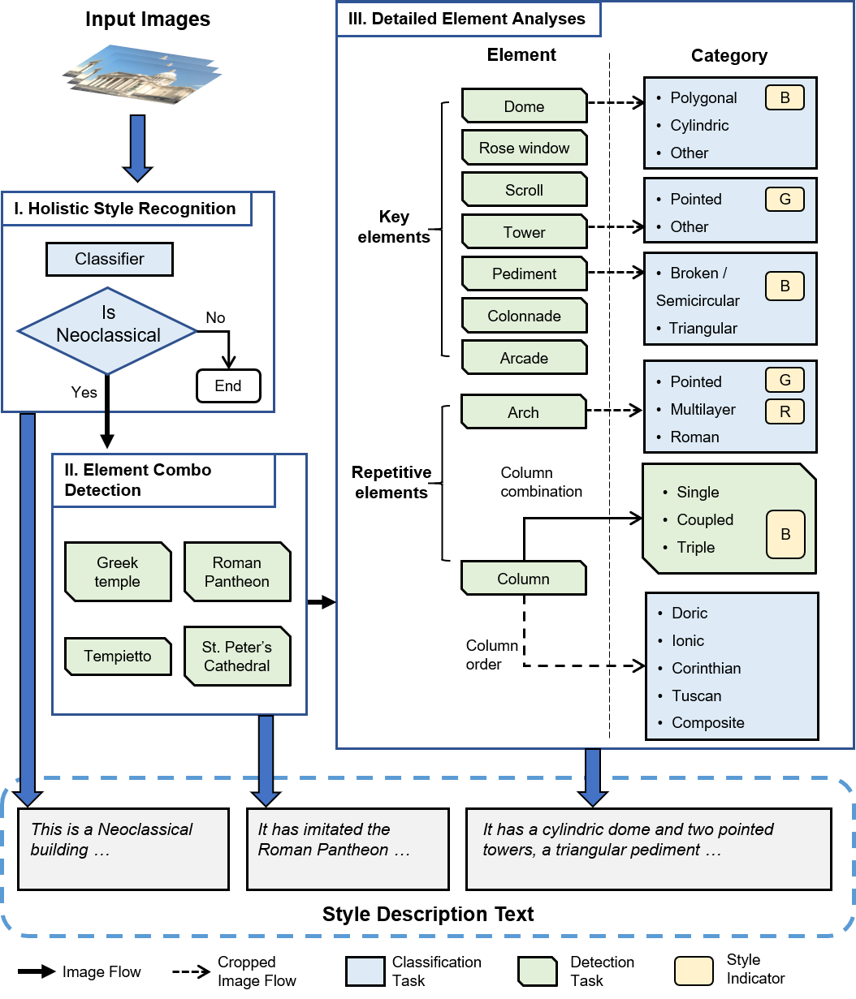
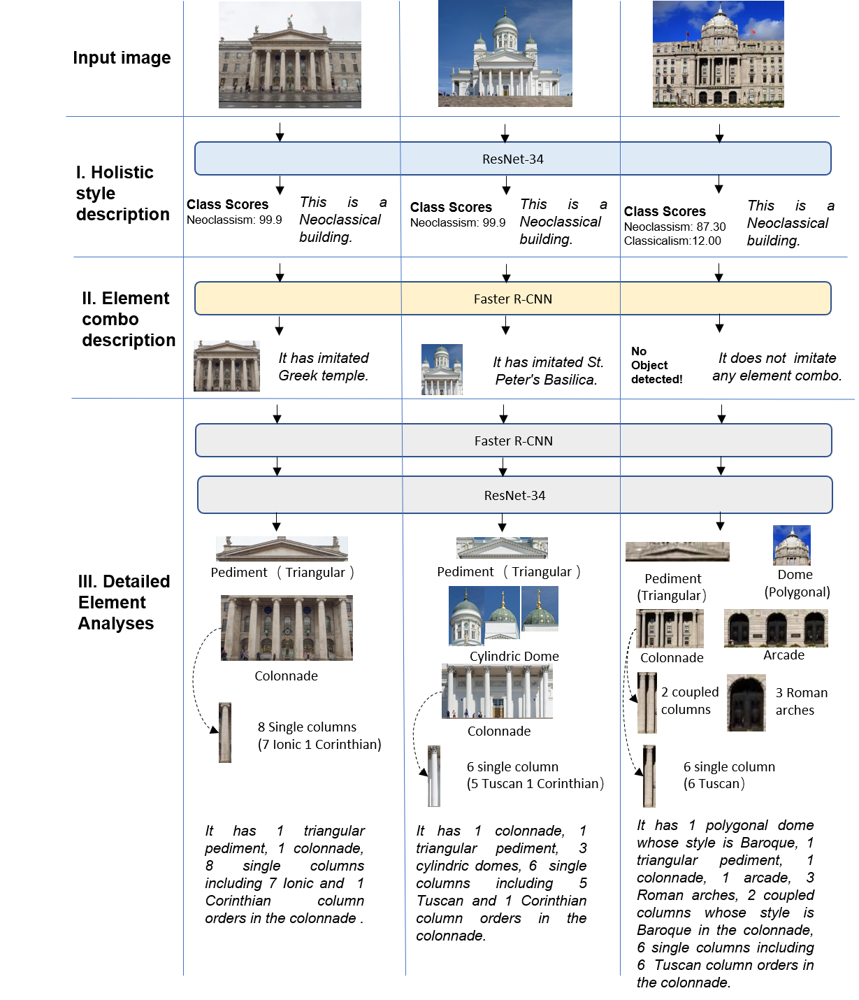

# NeoDescriber：Computer Vision and Rule-based Cascaded Model for Neoclassical Architecture Description

  ### Introduction
  Based on the combination of computer vision models and expert knowledge in Architecture, this paper proposes a novel model for the identification and description of Neoclassical buildings in an automatic way. This cascaded model treats the description of a monument’s style as a coarse-to-fine process, it can not only identify its holistic architectural style category, but also describe the distribution and combination of its featured architectural elements. Fig 2 shows the description of three example monuments respectively.



<center>Fig.1 The framework and workflow for the style description model - NeoDescriber. Rounded boxes indicate element styles: B for Baroque, G for Gothic, R for Romanesque. </center>



<center>Fig.2 The description of three example monuments by NeoDescriber. From left to right, there are General Post Office (Dublin), Helsinki Cathedral, and the building of Shanghai Pudong Development Bank. </center>

### Download  of Neural Network Weight


### How to install 
==NeoDescriber requires Python environment(>=3.7).==

You can use the following command to install some packages in the NeoDescriber folder.

``` shell
pip install -r requirements.txt
```
### Download trained model weights

<a href="https://drive.google.com/file/d/1hW6u_YmdBM2acwddWmhJkQ98PHm4y5Ys/view?usp=sharing">Click</a> to download weights, and copy the folder to the project folder. 

### How to use

<p>You can find <i>main.py</i> in the script source folder.</p>
<p><i>Note: we recommend absolute paths for folder paths in parameters.</i></p>

<h5> main.py can be called with the following syntax:</h5>
<code class="language-">
USAGE: main.py --img-path [path-to-img]  --output-dir  [path-to-outputdir]

        Example usage:
        	python main.py   --img-path ./Dublin.jpg  --output-dir  ./result
</code>


<hr width="20%" align="left"/>
<br/>
Reference:<br/>
  Qin, W., Chen, L., Zhang, B., Chen, W., Luo, H., NeoDescriber：Computer Vision and Rule-based Cascaded Model for Neoclassical Architecture Description.

  <p class=footer>
    &copy; Copyright 2022  by <a href="http://ndc.hust.edu.cn">NDC at hust</a></p>
